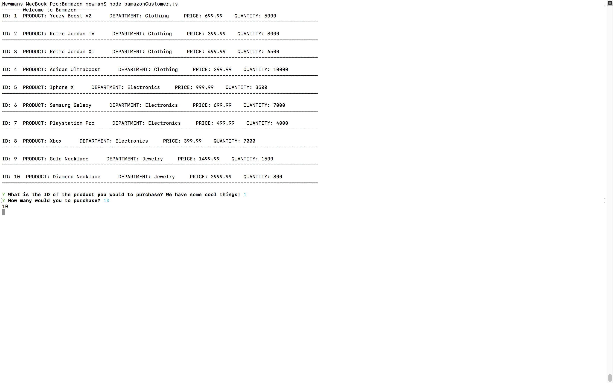

# Bamazon

Hello, Welcome to my Bamazon app, where you can pretend to buy awesome things from my digital storefrotn using MySQL and NODE.js command lines!

This app receives orders from the customer and updates the store's stock by communicating with MySQL.

Refer to my scehma.sql file to create the same database I created, or of course you can create your own.

My javaScript file bamazonCustomer.js communicates with SQL and allows the application to work behind the scenes.

To start use your MySQL Workbench or Sequel Pro and use the following command:

Create Database Bamazon;

Select the database by typing in and running the following command:

Use Bamazon;

Refer to the schema.sql file to fill in the required data that will be put in the database.

Now for the Node side of things, you will need to install two npm packages using your Terminal.

The two dependencies that are used are, Inquirer and mysql.

In your Terminal run the commands "npm install Inquirer", and "npm install mysql".

Now to demonstrate its functionality!

Below are some screenshots to help.

In your Terminal run the command "node bamazonCustomer.js" to run the program

Then you will be prompted to choose a product by ID number. Choose any product you would like and you will be asked how many. If the product has enough stock your order will be processed.

